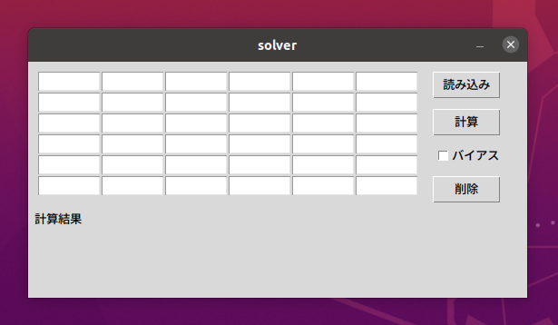
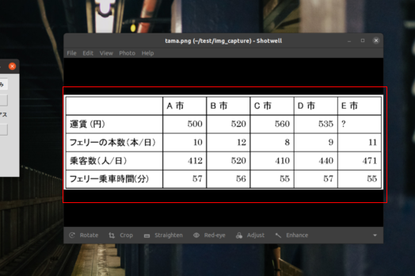
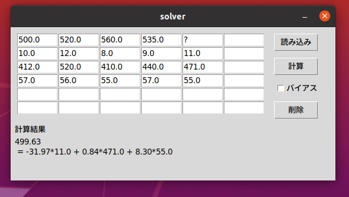
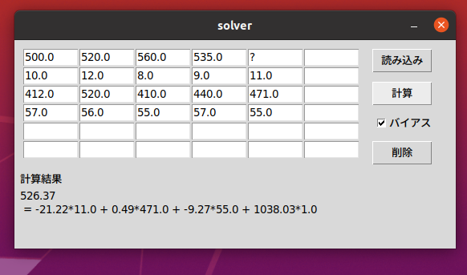

# tama_table_solver
玉手箱の空欄推測問題を線型回帰で解くプログラムです．

## 動作確認環境
- Ubuntu 20.04.4 LTS
- Python 3.8.10

## 必要なライブラリ
- numpy
- pyautogui
- pyocr
- tkinter

## 使用方法
### 起動
```
python3 main.py
```
を実行すると，以下のようなウインドウが開く．



### 値入力
表に数値を入力する．このとき，予測したい箇所は？を入力する．

もしくは読み込みを選択すると画面のスクリーンショットが表示されるので，表が領域を下の図のように選択して，Enterキーを押すと自動で表が埋まる．自動入力する場合は間違った値が入力されてしまう場合もあるので，そのような場合はもう一度読み込み直すか，間違っている部分の値を自分で入力する．


### 計算
値が入力できたら計算を押すと，計算結果が表示される．
バイアス項を含めて計算したい場合はチェックボックスにチェックを入れて，計算を押す．


